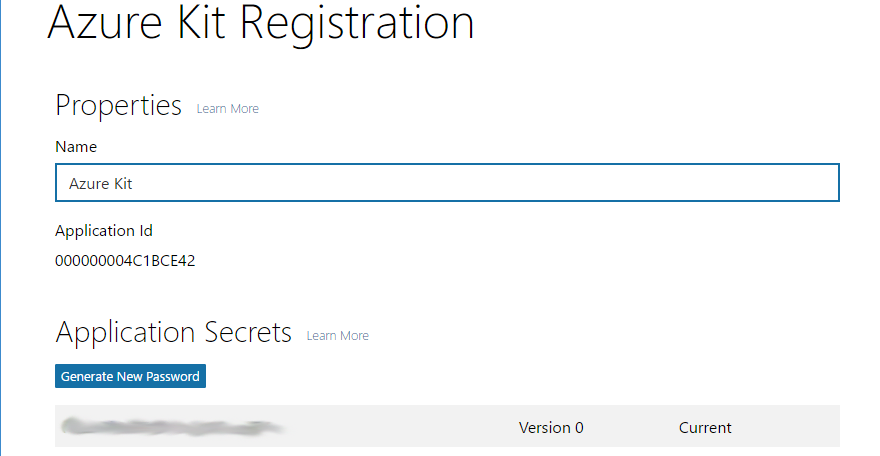
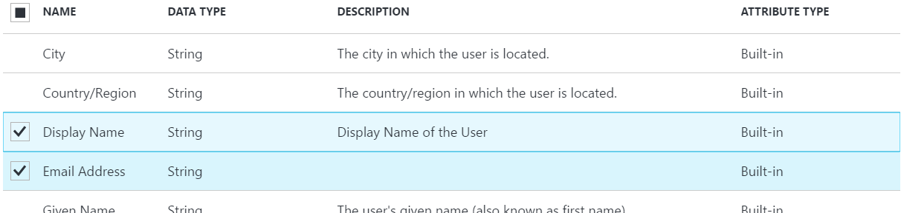

# Azure AD B2C Setup

The following steps will walk you through how to set up an authentication mechanism to 
allow your customers to register on your site so that you can communicate with them and 
secure their transactions

To do this we will be using Azure Active Directory (Azure AD for short), specifically 
we will use an Azure AD B2C (Business to Consumer)
directory, which enables users to authenticate through various popular social media
sites, or with a Microsoft Account. With a B2C directory, users do not need to be
added in advance - you can define a policy that enables, say, any user who can
authenticate with a Microsoft Account to join.

## Create an Azure AD B2C Directory

The main site is designed to be open to all and not need authentication
for someone just browsing the site. However, in order to allow users to create and 
track orders it is good to have an authentication mechanism for the site. By adding
AD B2C you can provide a mechanism where a user can opt in to (and back
out of) your site. For that to work, we need some way of authenticating users - we 
can't just let someone type in any old email address and trust that it's valid. 
So although we won't force all users to log in, we will need them to authenticate 
if they want to receive emails, and manage the settings for that.

Fortunately, Azure AD can still help us. We can create a different kind of tenant: a
*B2C* (Business to Consumer) tenant. You may recall there was a checkbox for this when
you created the tenant earlier. If you select this option, the tenant behaves quite
differently. Instead of allowing in only those users explicitly added by a tenant
adminstrator, you can configure a B2C tenant to allow in any user at all. AAD still
requires them to authenticate, but there are a few ways it can do this. You can configure
it to allow anyone with a Microsoft Account (formerly called a Live ID) to log in.
You can also enable login through Google, Facebook, LinkedIn, or Amazon accounts.
Furthermore, Azure AD can authenticate users directly through their email address -
if you enable this, users will be able to enter an email address, and it will send
an email containing a verification link to enable them to prove that they own the
email address.

1.  Go to the Azure management site (not the portal) at
    [https://manage.windowsazure.com/](https://manage.windowsazure.com/) and as
    with earlier in this lab, scroll down through the icons on the left to find the
    **Active Directory** entry, which is near the bottom.

    

2.  As before, click the **+ NEW** button near the bottom left of the page:

    

3.  In the **NEW** panel that opens, the first two columns will already have
    selected **APP SERVICES** and **ACTIVE DIRECTORY** for you. In the third column,
    click **DIRECTORY**

    

    then click **CUSTOM CREATE**

    

4.  An **Add directory** dialog will appear. As before, enter a
    **NAME** and a **DOMAIN NAME**. These should be different than the ones you used
    when creating the tenant for the management site. Select your country
    
    Unlike last time, you should check the B2C checkbox.

    

    Azure might show you a warning indicating that this will be a slow operation -
    B2C tenants take longer to create than normal ones.

    **Note:** you will need the domain name later, so as with last time, take a note
    of the value you entered.

    Click the tick at the bottom right when you have filled everything in. Wait until
    the tenant has been created. (Watch the progress information at the bottom of the
    screen.)

5.  Once the directory is ready, it will appear in your list of tenants. Strangely,
    although you need to use the old Azure Management site to *create* a B2C tenant,
    the only way to *configure* a B2C tenant is in the newer Azure portal. So you will
    now need to navigate to [https://portal.azure.com/](https://portal.azure.com/)

    **Note:** even if you have the portal open in a browser, it is worth opening a new
    tab, because as you will see, it is tricky to navigate between the pages for
    configuring a B2C tenant, and the pages for configuring your web apps.

6.  At the top right of the portal is a button showing your username and the name
    of the tenant associated with your subscription. If you click this, it shows a
    list of tenants that you belong to:

    

    This will include the new B2C tenant that you just created. Select that.

7.  Once you have selected the B2C tenant, you will see a fresh dashboard - none of
    the resources you created earlier will be visible. This is because you can only
    access resources in Azure subscriptions associated with the selected tenant, and
    there are no Azure Subscriptions associated with this new tenant. (Each Azure
    subscription is controller by exactly one Azure AD tenant, and creating a new
    tenant doesn't change that. You can move subscriptions between tenants if you
    want to, but it doesn't happen automatically. So a freshly-created tenant will
    never have any associated Azure subscriptions to begin with.) This is why we
    recommended that you use a new browser tab for this work - by switching tenants,
    you cause all your Azure resources to become inaccessible. (Obviously you can
    switch back, but then you won't be able to configure your new B2C tenant.)

8.  On the left hand side, click the **More services** label:

    

    In the filter textbox that appears, type **B2C**, at which point you should see
    an **Azure AD B2C** entry in the list. Click on the star to the right of this, to
    pin this to the list of icons and labels on the left of the page.

    

9.  Click on the new **Azure AD B2C** label that just got added to the list on the left.
    The Azure portal will show the blade for configuring your B2C tenant. (It might show
    a big warning telling you that this tenant is not associated with a subscription.
    You can ignore that for these labs.)

10. You must first tell Azure AD which identity providers to use, and supply it with
    the details it requires to work with them. In the **Settings** column, click the
    **Identity providers** entry. It will initially show that no social identity
    providers have been configured. Click the **+ Add** button at the top of the blade.

    In the **Add social identity provider** blade that opens, enter *MSA* in the
    **Name** field, then click on **Identity provider type**. In the list that
    appears, select **Microsoft Account**.

    

    Click **OK**.

11. Back in the **Add social identity provider** blade, click **Set up this
    identity provider**. This will show a blade asking for the **Client ID** and
    **Client Secret**. These are values that you need to obtain from the Microsoft
    Account system, so you will need to go to
    [http://go.microsoft.com/fwlink/p/?LinkId=262039](http://go.microsoft.com/fwlink/p/?LinkId=262039)
    and log in with a Microsoft Account.

12. In the **My applications** page find the **Live SDK applications** section, and
    click its **Add an app** button. (There will be more than one such button - make
    sure to click the one in the right section.) Enter a name for the application:

    

    Click **Create application**

13. In the page that opens representing the new application, you will see some details:

    

    This contains the two values you need. Copy the **Application Id** in the
    **Properties** section and past it into the **Client ID** field in the browser
    tab in which you're setting  your B2C tenant. Then in the **Application Secrets**
    section, copy the string of random looking characters in that section and
    paste it in as the **Client secret** for the B2C settings.

    You can click **OK** in the B2C settings now, and then click **Create**.

    You're not yet done with the Microsoft Account settings though. You need to give
    it the URL that Azure AD will supply as a redirect URL during log in. This URL
    will have the following form:

    `https://login.microsoftonline.com/te/YOUR-TENANT-ID/oauth2/authresp`

    You will need to replace `YOUR-TENANT-ID` with your tenant's unique GUID.
    To discover your B2C tenant's ID, you'll need to go back to the Azure management
    site. If you're not already there, go to the page for your B2C tenant, and then
    look in the address bar - it will have a URL with a `#` followed by the text
    `Workspaces/ActiveDirectoryExtension/Directory` followed by a GUID. That GUID is
    your tenant id.

    Enter this in the **Redirect URIs** section of the **Web** block under
    **Platforms** in the Microsoft Account application page:

    

    Click **Add Url**. Then at the bottom of the page click **Save**

    You have now completed the Microsoft Account configuration.

14. Back in the Azure portal, you will also need to configure a *Sign In/Sign Up*
    policy for your B2C tenant, to tell it who should be allowed to log into the
    site. Close the **Identity provider** blade if it is still open, then in the
    **Settings** blade, under **POLICIES** select **Sign-up or sign-in policies**

    

    In the **Sign-up or sign-in policies** blade that opens click the **+ Add** button.

    

15. In the **Add policy** dialog set the name to **SignUpOrIn**. Click on **Identity
    providers** and then check the **MSA** checkbox.

    

    Click **OK**.

    Select **Sign-up attributes**. In the **Select sign-up attributes** blade,
    check **Display Name** and **Email Address**
    
    

    Click **OK**.

    Select **Application claims**, and again check **Display Name** and **Email Address**
    then click **OK**.

    Click **Create** in the **Add policy** blade.